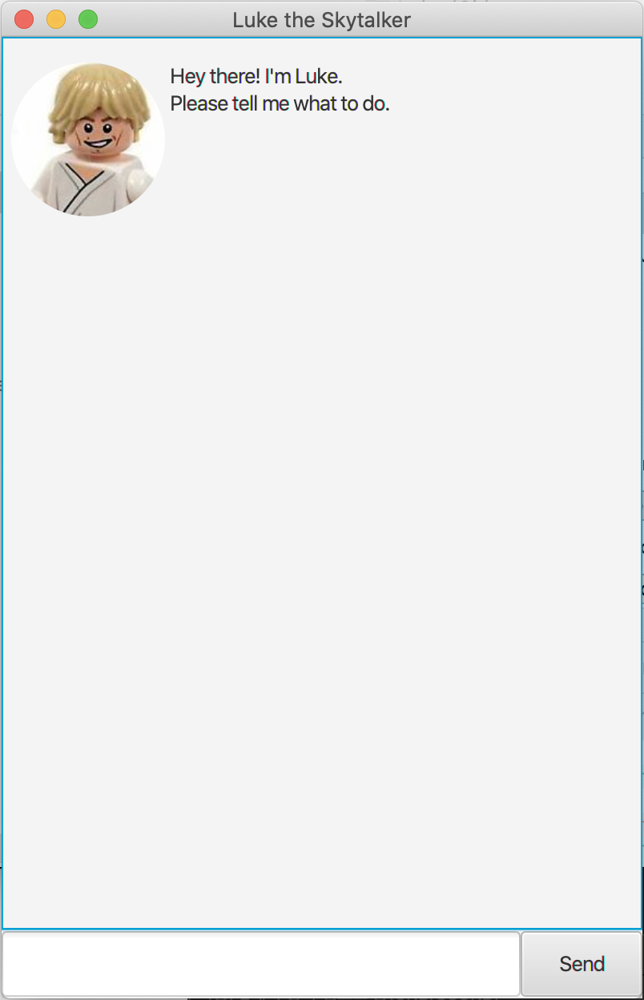

# User Guide
Luke is the **go-to desktop app for managing tasks, deadlines, and events**. Optimized for use via a Command Line Interface (CLI) while still having the benefits of a user-friendly Graphical User Interface (GUI), Luke guarantees easy and convenient user experience.

* Quick start
* Features
    * Adding new tasks : 
        1. `todo`
        2. `deadline`
        3. `event`
    * Deleting tasks : `delete`
    * Marking tasks as done : `done`
    * Listing out current tasks : `list`
    * Finding specific tasks : `find`

##Quick start
1. Ensure you have Java `11` or above installed in your Computer.

2. Download the latest `luke.jar` from here.

3. Copy the file to the folder you want to use as the home folder for your `Luke`.

4. Double-click the file to start the app. The GUI similar to the below should appear in a few seconds. Note how the app contains some sample data.


5. Type the command in the command box and press Enter to execute it. 
e.g. typing `list` and pressing Enter will list out the current tasks.
Some example commands you can try:

    * **`list`** : Lists out all current tasks.

    * **`todo`** `eat fried chicken` : Adds a task named `eat fried chicken` to Luke.

    * **`delete`** `3` : Deletes the 3rd task shown in the current list.

    * **`bye`** : Exits the app.

6. Refer to the Features below for details of each command.

##Features
>  :information_source: Notes about the command format:
>
> * Words in UPPER_CASE are the parameters to be supplied by the user.
>e.g. in `todo DESCRIPTION`, `DESCRIPTION` is a parameter which can be used as `todo eat fried chicken`.
>
> * `DATE` parameter must be provided in the following format : `YYYY-MM-DD` 
>eg. 2020-02-02

### Adding new tasks : `todo`
Adds a new task to the current list.

Format : `todo DESCRIPTION`

Example of usage :
```
todo eat fried chicken
```

Expected outcome : 
```
The following task has been successfully added.
-> [T][X] eat fried chicken
Now you have 1 task in your list.
```

### Adding new tasks : `deadline`
Adds a new deadline to the current list.

Format : `deadline DESCRIPTION /by DATE`

Example of usage :
```
deadline do laundry /by 2020-02-02
```

Expected outcome : 
```
The following task has been successfully added.
-> [D][X] do laundry (by: Feb 2, 2020)
Now you have 2 tasks in your list.
```

### Adding new tasks : `event`
Adds a new deadline to the current list.

Format : `event DESCRIPTION /at DATE`

Examples of usage :
```
event practice guitar /at 2020-03-03
```

Expected outcome : 
```
The following task has been successfully added.
-> [E][X] practice guitar (at: March 3, 2020)
Now you have 3 tasks in your list.
```

### Deleting tasks : `delete`
Deletes a task from the current list.

Format : `delete NUMBER`

Example of usage :
```
delete 2
```

Expected outcome : 
```
The following task has been successfully deleted.
-> [D][X] do laundry (by: Feb 2, 2020)
Now you have 2 tasks in your list.
```

### Marking tasks as done : `done`
Marks a task from the current list as done.

Format : `done NUMBER`

Example of usage :
```
done 1
```

Expected outcome : 
```
The following task has been successfully marked as done.
-> [T][V] eat fried chicken
```

### Listing out current tasks : `list`
Lists out all the current tasks.

Format : `list`

Example of usage :
```
list
```

Expected outcome : 
```
Here are the tasks in your list.
-> 1.[T][V] eat fried chicken
-> 2. [E][X] practice guitar (at: March 3, 2020)
```

### Finding specific tasks : `find`
Finds specific tasks that matches the given keyword.

Format : `find KEYWORD`

Example of usage :
```
find chicken
```

Expected outcome : 
```
Here are the tasks that contain the keyword 'chicken'
-> [T][V] eat fried chicken
```

### Exiting the program : `bye`
Exits the program immediately.

Format : `bye`

Example of usage :
```
bye
```